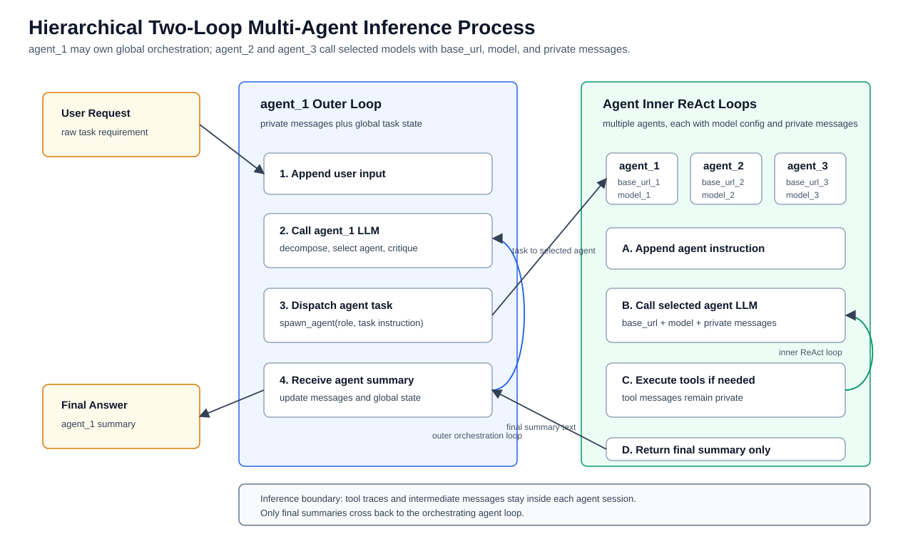
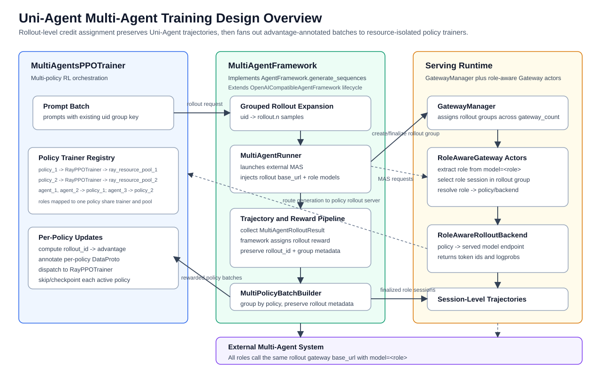
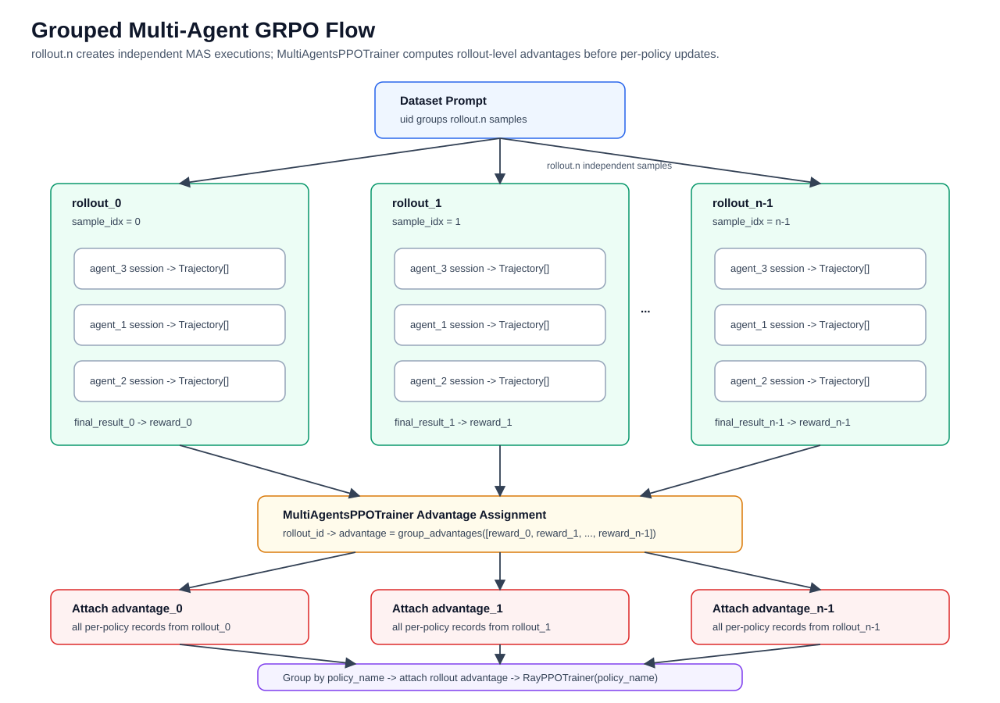
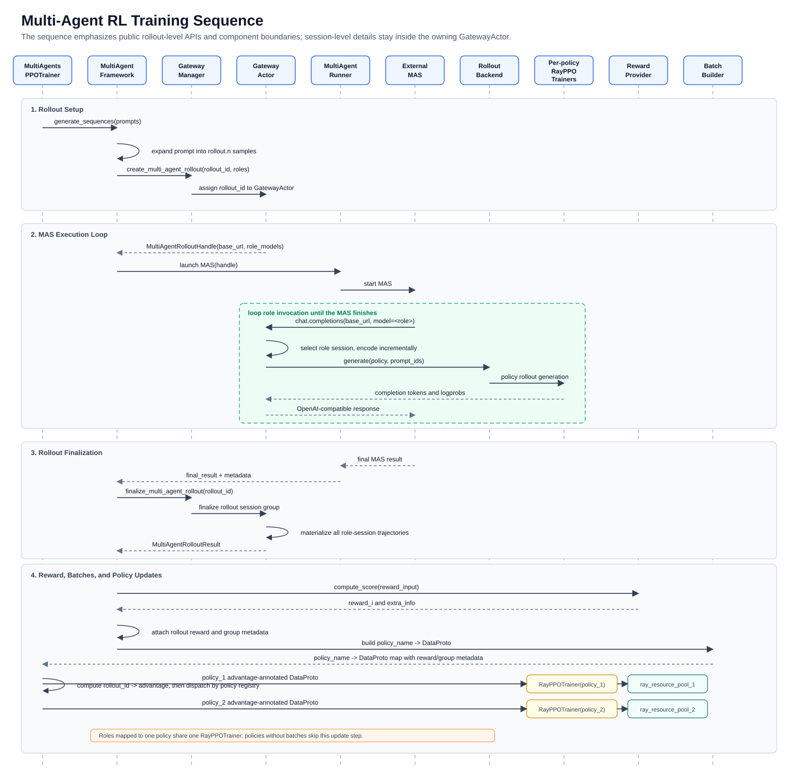

# RFC: Multi-Agent Blackbox Training

Status: Draft

Authors: Uni-Agent contributors

## Summary

This RFC proposes a Uni-Agent-native framework for multi-agent blackbox
training. The design extends the existing blackbox agent training path used by
`examples/swe_agent_blackbox` from one agent loop and one trainable policy to
multiple external agent roles, multiple trainable policies, role-aware
session routing, and per-policy PPO updates.

The proposal keeps the blackbox integration model and extends it to
multi-agent systems:

- external multi-agent systems remain independent applications;
- a role-aware gateway endpoint receives OpenAI-compatible model requests from
  each role;
- role requests are routed to the correct policy rollout service;
- trajectories are collected with Uni-Agent's existing session-level
  `Trajectory` format;
- rewards are bridged back into per-policy training batches.

The goal is to make multi-agent blackbox training a first-class Uni-Agent
capability, built on Uni-Agent's session runtime, gateway, sandbox, reward, and
`verl` integration.

## Motivation

Many agent systems are not single monolithic policies. They are orchestration
graphs with distinct roles, for example:

- verifier, searcher, answerer;
- planner, executor, reviewer;
- manager, coder, tester;
- router, specialist agents, final responder.

These roles may require different training signals, sampling parameters,
context budgets, model checkpoints, or update schedules. A single-agent
blackbox runner can execute such a system if all roles call the same model
endpoint, but it cannot train each role as an explicit policy.

Production multi-agent systems often add another constraint: they can be
hierarchical two-loop systems internally while still exposing only abstract
agent roles such as `agent_1`, `agent_2`, and `agent_3` to Uni-Agent. One agent
may own the outer orchestration loop, keep private messages and global state,
repeatedly dispatch work to other agents, review their final summaries, and
decide whether to continue, retry, or finish. Other agents may own private
inner ReAct loops, keep their own message history across repeated invocations
in the same rollout, and return only final summaries. A role invocation is
therefore not a trajectory finalization boundary; Uni-Agent should preserve
role sessions until the whole multi-agent rollout is complete.

The figure focuses on MAS inference rather than training components. Each
agent LLM request carries that agent's configured `base_url`, `model`, and
private messages, allowing different agent roles to target different model
endpoints while keeping their internal histories isolated.



Uni-Agent already has the core infrastructure for blackbox agent training:

- OpenAI-compatible gateway sessions;
- sandbox-backed agent execution;
- reward propagation through `complete_session(reward_info)`;
- `verl` integration for scalable reinforcement learning;
- a blackbox sidecar pattern in `examples/swe_agent_blackbox`.

What is missing is a multi-agent training layer that can represent:

- role to policy mappings;
- per-role request routing;
- role-aware session and trajectory collection;
- per-policy batch construction;
- multi-policy validation and checkpointing;
- per-policy trainer resource isolation for production workloads;
- blackbox external MAS execution without rewriting the MAS into Uni-Agent
  internals.

This RFC proposes to add a Uni-Agent-native multi-agent blackbox training path
with a concrete scope:

- support blackbox training for external multi-agent systems;
- preserve the non-invasive integration model, so an external MAS can keep
  running as a standalone application;
- allow arbitrary role-to-policy mappings, including shared policies, per-role
  policies, and mixed mappings;
- collect token-level trajectories through Uni-Agent-compatible gateway
  sessions while preserving role and policy metadata;
- convert collected trajectories into per-policy `DataProto` batches;
- orchestrate one `RayPPOTrainer` per unique policy when roles require
  separate policies, with independent resource pools where configured;
- reuse Uni-Agent's existing `AgentFramework`, Gateway, and `verl` training
  stack where possible;
- support grouped rollout algorithms such as GRPO at the multi-agent rollout
  level;
- keep the existing single-agent blackbox recipe as a special case.

## Background

### Existing Uni-Agent Blackbox Training

The current blackbox training recipe runs an external agent inside or next to a
sandbox. The runner creates a Uni-Agent gateway session, starts the blackbox
agent, points the agent at the gateway, evaluates the reward, and returns the
result through `complete_session(reward_info)`.

This is sufficient when the rollout is conceptually one agent and one policy.
For multi-agent systems, the gateway needs more structure: each model request
must carry a role identity, route to a corresponding policy, and preserve that
role/policy metadata on the finalized Uni-Agent trajectory.

### Desired Multi-Agent Blackbox Pattern

A practical Uni-Agent-native multi-agent blackbox training path should preserve
the existing non-invasive integration model:

1. The MAS application is launched by a configured `MultiAgentRunner`.
2. `MultiAgentRunner` injects one rollout-scoped Uni-Agent Gateway `base_url`
   into the MAS model configuration.
3. Each request uses a role name as the requested model.
4. The owning Gateway actor maps role names to policy rollout backends.
5. The Gateway records messages, prompt ids, response ids, logprobs, and
   metadata.
6. A trajectory collector collects finalized gateway trajectories by role
   session and attaches role/policy metadata.
7. The multi-agent framework computes or imports final and optional per-role
   rewards through the existing reward worker/provider mechanism.
8. A batch builder groups trainable records by `policy_name` and emits one
   `DataProto` batch per policy.

For grouped algorithms such as GRPO, the same dataset prompt should create a
group of independent multi-agent rollouts. Each rollout owns its own set of
role-aware gateway sessions and produces one final task result by default.
Within one rollout, all participating agent roles should call the same
rollout-scoped gateway `base_url`; the `model` field identifies the role.

This RFC proposes to implement this pattern with Uni-Agent-native abstractions
and integration points. The role-aware request interception should be provided
as an extension of the existing Uni-Agent Gateway.

## Design Overview

The design keeps the same high-level boundary as Uni-Agent's existing
blackbox training path: the trainer requests rollout batches through the
`AgentFramework.generate_sequences(prompts)` contract, the framework
implementation launches the external agent system, and the serving runtime
owns gateway sessions and trajectory assembly. The multi-agent extension adds
role-aware routing, role-policy mapping, grouped rollout metadata, and
per-policy batch construction.

The closest implementation model is the current
`OpenAICompatibleAgentFramework`: create gateway sessions, launch an external
runner, finalize Gateway-collected `Trajectory` objects, score finalized
outputs through a reward worker or reward provider, and write Uni-Agent
compatible training records. The multi-agent proposal generalizes this
lifecycle from "one rollout sample is one gateway session" to "one rollout
sample is a set of role-aware gateway sessions".



## Proposed Architecture

The proposed architecture introduces a multi-agent blackbox implementation of
Uni-Agent's existing `AgentFramework` contract with the following components.
The component order starts from the training orchestrator and policy/resource
topology, then follows the rollout, gateway, trajectory, reward, and
batch-building path.

### MultiAgentsPPOTrainer

`MultiAgentsPPOTrainer` is the PPO trainer orchestrator for multi-agent
blackbox training. It owns the policy trainer registry and coordinates one or
more `verl` `RayPPOTrainer` instances.

It owns the top-level training loop: `MultiAgentsPPOTrainer.fit()` collects
multi-agent rollouts, computes rollout-level training signals, and schedules
per-policy update steps on the registered `RayPPOTrainer` instances.

It is responsible for:

- validating the configured role-to-policy mapping;
- creating one `RayPPOTrainer` per unique trainable policy;
- assigning each policy trainer to its configured `ray_resource_pool`;
- computing rollout-level grouped advantages from `uid`-grouped reward tables;
- attaching each `rollout_id -> advantage` value to all records from that
  rollout;
- dispatching each advantage-annotated `policy_name -> DataProto` batch to the
  matching trainer;
- coordinating skipped updates, global step consistency, and checkpointing
  across policies.

`MultiAgentsPPOTrainer` schedules per-policy update steps and invokes the
necessary update interfaces on each registered `RayPPOTrainer`. The PPO update
mechanics are executed by the underlying `RayPPOTrainer` instances and their
worker groups. The multi-agent trainer should keep rollout collection, batch
construction, grouped advantage assignment, and per-policy update dispatch as
separate concerns.

#### Per-Policy PPO Runtime Configuration

Each policy's PPO runtime config should be composed at the policy config root,
then passed to that policy's `RayPPOTrainer`. The outer multi-agent config
should not package a full trainer config under `policies.<policy_name>`, because
the public PPO trainer configs contain root-level Hydra defaults and
root-relative interpolations.

The proposed configuration shape is:

```yaml
ppo_trainer_config_source:
  kind: config_module
  value: verl.trainer.config

policies:
  policy_1:
    ppo_trainer_config_name: ppo_trainer
    ppo_trainer_overrides:
      trainer:
        ray_resource_pool: policy_1_pool
      actor_rollout_ref:
        model:
          path: ${oc.env:POLICY_1_MODEL_PATH,???}

  policy_2:
    ppo_trainer_config_name: ppo_trainer
    ppo_trainer_overrides:
      trainer:
        ray_resource_pool: policy_2_pool
      actor_rollout_ref:
        model:
          path: ${oc.env:POLICY_2_MODEL_PATH,???}
```

For each policy, `MultiAgentsPPOTrainer` should:

- compose `ppo_trainer_config_name` as a root-level config from
  `ppo_trainer_config_source`;
- resolve `ppo_trainer_overrides` in the outer multi-agent config context;
- merge the resolved overrides into the policy root config;
- set the policy identity, then construct the corresponding `RayPPOTrainer`.

This preserves the public PPO trainer config semantics while keeping
multi-agent orchestration fields such as `role_policy_mapping`,
rollout-level Gateway settings, and grouped rollout metadata in the outer
config.

### Policy-Trainer Topology and Resource Isolation

The trainer topology is policy-centric. `role_policy_mapping` first resolves
`m` MAS roles to `n` unique trainable policies, where `n <= m`.
`MultiAgentsPPOTrainer` should derive the runtime trainer and resource topology
from the set of unique policies, not from the number of roles.

The design should make four identities explicit:

- **role**: the external MAS agent identity, such as `agent_1`, `agent_2`, or
  `agent_3`;
- **policy**: the trainable model identity used by Uni-Agent and `verl`, such
  as `policy_1`;
- **trainer**: the per-policy `RayPPOTrainer` runtime and worker owner that
  executes scheduled update steps;
- **ray_resource_pool**: the Ray resource pool assigned to that trainer.

The core topology is:

```text
role -> policy
unique(policy) -> RayPPOTrainer(policy) -> ray_resource_pool
```

The topology supports one-to-one mappings, all-shared mappings, and mixed
mappings because runtime trainers are derived from `unique(policy)`. For
example, `agent_1` and `agent_2` may share `policy_1`, while `agent_3` maps to
`policy_2`:

```text
agent_1 -> policy_1 -> RayPPOTrainer(policy_1) -> ray_resource_pool_1
agent_2 -> policy_1 -> RayPPOTrainer(policy_1) -> ray_resource_pool_1
agent_3 -> policy_2 -> RayPPOTrainer(policy_2) -> ray_resource_pool_2
```

Each unique policy can own independent actor workers, rollout workers,
tokenizer handles, rollout server handles, optimizer state, checkpoint
directories, and failure domains. Roles mapped to the same policy share that
policy's trainer and resource pool. A large planner policy can therefore use a
different GPU allocation, parallelism strategy, rollout capacity, or checkpoint
schedule than a smaller worker policy, while roles that intentionally share a
policy reuse the same runtime.

`MultiAgentsPPOTrainer` should own the policy trainer registry and enforce
this topology:

- create one `RayPPOTrainer` per unique policy;
- assign each policy trainer its configured `ray_resource_pool`;
- collect per-policy rollout server, tokenizer, and checkpoint handles;
- use `role -> policy_name` metadata for gateway routing and per-policy rollout
  backend handle collection;
- dispatch each `policy_name -> DataProto` batch to the matching trainer;
- skip policies with no samples in the current step;
- checkpoint and restore each configured policy independently.

The gateway uses `role -> policy_name` to route generation requests to the
correct rollout backend. Optional `served_model_name` fields remain rollout
server observability names for metrics and service display. The batch builder
emits `policy_name -> DataProto`. `MultiAgentsPPOTrainer` then updates only
trainers that received a real batch in the current step.

### MultiAgentFramework

`MultiAgentFramework` is a Uni-Agent `AgentFramework`
implementation for blackbox multi-agent rollout. It preserves the existing
`generate_sequences(prompts)` trainer-facing contract while internally
coordinating multiple role-aware gateway sessions, external MAS execution,
reward assignment, grouped reward metadata propagation, and per-policy batch
construction.

It is responsible for:

- expanding each prompt into `rollout.n` multi-agent rollout samples;
- creating a rollout-scoped gateway `base_url` plus role-aware gateway sessions
  for the roles invoked by each rollout;
- invoking the configured blackbox MAS runner;
- collecting role-aware gateway session trajectories;
- scoring each multi-agent rollout;
- assigning rollout-level or role-level training signals;
- producing per-policy batches or scored trajectories;
- coordinating validation and failure handling.

For single-agent use cases, this framework should be able to run with exactly
one role and one policy.

### Relationship to OpenAICompatibleAgentFramework

`MultiAgentFramework` should reuse the lifecycle pattern of
`OpenAICompatibleAgentFramework` and extend the existing rollout stack for
multi-agent execution.

The existing single-agent blackbox lifecycle is:

```text
uid
  -> rollout.n independent gateway sessions
  -> agent_runner(session.base_url)
  -> Gateway records Trajectory objects
  -> finalize_session(session_id)
  -> _score_trajectories(...)
  -> write TransferQueue-compatible training records
```

The multi-agent lifecycle should extend that pattern to:

```text
uid
  -> rollout.n independent multi-agent rollouts
  -> each rollout owns one rollout-scoped gateway base_url
  -> each rollout owns multiple role-aware gateway sessions behind that base_url
  -> MultiAgentRunner launches the external MAS
  -> MAS repeatedly invokes that base_url with model=<role>
  -> each role session remains ACTIVE across repeated role invocations
  -> Gateway records one or more Trajectory objects per role session
  -> MultiAgentRunner finishes the whole multi-agent rollout
  -> framework runs finalize_multi_agent_rollout(rollout_id)
  -> score the finalized multi-agent rollout
  -> attach rollout-level reward and grouped metadata
  -> emit per-policy training records
```

This keeps trainer integration stable: the trainer still calls
`generate_sequences(prompts)`, while the multi-agent framework owns the extra
coordination required for multiple roles, multiple sessions, grouped rewards,
and per-policy output.

A role invocation is not a Gateway session boundary. In hierarchical MAS
workloads, one agent may call the same invoked agent role multiple times during
one rollout. Each invoked agent keeps its own private message history, appends
the new instruction, runs an internal ReAct loop, and returns only its final
text result. The role-aware Gateway session must remain active across those
invocations. `finalize_session(session_id)` is a session-level primitive, not
the public multi-agent abstraction. The
framework should expose a rollout-level finalization step, conceptually
`finalize_multi_agent_rollout(rollout_id)`, after the `MultiAgentRunner` has
finished the whole multi-agent execution. This rollout-level finalization is
the public multi-agent boundary. Internally, the owning Gateway actor should
use the rollout manifest to materialize all role-session trajectories in that
rollout group and then assemble them into one `MultiAgentRolloutResult`.

### RolePolicyMapping

`RolePolicyMapping` maps external MAS role names to trainable policy names.

Example:

```yaml
roles:
  - agent_1
  - agent_2
  - agent_3

role_policy_mapping:
  agent_1: policy_1
  agent_2: policy_1
  agent_3: policy_2
```

The first version should support any explicit mapping from configured roles to
configured trainable policies. Special cases include one-to-one mappings,
all-shared mappings, and mixed mappings where subsets of roles share a policy.

### RoleAwareGateway

`RoleAwareGateway` is an extension of Uni-Agent's existing Gateway. It exposes
the same OpenAI-compatible session endpoints to the external MAS, while adding
role-aware routing and recording. The MAS continues to call chat completions
normally. The requested model name or another explicit request field identifies
the agent role.

For multi-agent rollout, the Gateway-facing `base_url` should be
rollout-scoped rather than role-specific. The external MAS should point all
agent model clients in the same rollout at the same gateway `base_url`, and set
`model=<role>` on each request. The Gateway actor uses the request model to
select the role session and policy rollout backend.

The gateway:

- validates the active role-aware gateway session;
- extracts the role;
- renders messages into prompt ids using the role's tokenizer;
- routes the request to the correct policy rollout backend;
- returns an OpenAI-compatible response;
- records the generated tokens in Uni-Agent's existing trajectory format.

The first implementation should reuse `GatewayServingRuntime`,
`GatewayManager`, and `GatewayActor` concepts where possible. A role-aware
gateway session should behave like the existing blackbox gateway session for
single-agent workloads, with additional role and policy metadata for
multi-agent workloads.

### GatewayManager and Gateway Responsibilities

`GatewayManager` should remain the session-routing layer. It owns the pool of
Gateway actors created from `gateway_count`, selects a Gateway actor when a
session or rollout session group is created, and routes `complete_session`,
`finalize_session`, `finalize_multi_agent_rollout`, and `abort_session` calls
back to the actor that owns the session group. It should not own tokenization,
role routing, rollout generation, reward handling, or trajectory
materialization.

For multi-agent rollout, `GatewayManager` should preserve rollout-level actor
affinity: all role-aware sessions that belong to one `rollout_id` should be
owned by the same Gateway actor. Different rollout session groups can still be
distributed across `gateway_count` for load balancing.

The Gateway actor should own the role-aware training behavior. It receives the
OpenAI-compatible request for a rollout-scoped gateway `base_url`, extracts the
role from the request `model`, resolves the role to a policy, selects that
role's session state inside the rollout session group, renders the prompt with
the policy tokenizer, calls the role-aware rollout backend, and materializes
trajectories when the rollout is finalized.

This keeps the multi-agent proposal aligned with the current Uni-Agent gateway
split: `GatewayManager` schedules sessions or rollout session groups across
Gateway actors, while each Gateway actor owns request handling and trajectory
state for its sessions.

### Rollout Session Group Manifest

The current Uni-Agent Gateway state is session-scoped:

```text
GatewayActor
  _sessions[session_id] -> GatewaySessionState
```

Multi-agent rollout needs one layer above this existing session state. The
Gateway actor should maintain a rollout-level manifest that groups the role
sessions belonging to the same multi-agent execution:

```text
MultiAgentRolloutState
  rollout_id
  sample_idx
  uid
  phase
  role_sessions:
    agent_1:
      session_id
      policy_name
      phase
      metadata
    agent_2:
      session_id
      policy_name
      phase
      metadata
    agent_3:
      session_id
      policy_name
      phase
      metadata
  metadata:
    parent_child_links
    invocation_records
    reward_info
```

The manifest is a routing and lifecycle index, not a replacement for
`GatewaySessionState`. Each role session should continue to use Uni-Agent's
existing `GatewaySessionState`, message history, `TrajectoryBuffer`, full
encoding, and incremental encoding behavior. The additional rollout layer
provides:

- `rollout_id -> role -> session_id` lookup;
- `session_id -> rollout_id`, role, and policy metadata;
- rollout-level phase tracking for completion, finalization, and abort;
- actor affinity for all role sessions in the same rollout;
- a stable place to record invocation relationships and optional runner
  metadata.

`finalize_multi_agent_rollout(rollout_id)` should be routed to the Gateway
actor that owns the rollout group. That actor should read the manifest,
materialize each underlying role session's active trajectory, assemble the
resulting trajectories into a `MultiAgentRolloutResult`, and then remove both
the manifest and the finalized role sessions. This keeps trajectory storage
Uni-Agent-native while giving multi-agent training a first-class rollout
boundary.

### Multi-Agent Rollout API Contract

The public multi-agent lifecycle should be rollout-scoped. Existing
session-level APIs remain valid for single-agent blackbox workloads, while the
multi-agent path should expose a small rollout-level contract:

```python
create_multi_agent_rollout(
    rollout_id: str,
    roles: list[str],
    role_policy_mapping: dict[str, str],
    metadata: dict[str, Any] | None = None,
) -> MultiAgentRolloutHandle

complete_multi_agent_rollout(
    rollout_id: str,
    reward_info: dict[str, Any] | None = None,
) -> None

wait_for_multi_agent_rollout_completion(
    rollout_id: str,
    timeout: float | None = None,
) -> None

finalize_multi_agent_rollout(
    rollout_id: str,
) -> MultiAgentRolloutResult

abort_multi_agent_rollout(
    rollout_id: str,
) -> None
```

`MultiAgentRolloutHandle` should contain:

- `rollout_id`;
- one rollout-scoped Gateway `base_url`;
- role to model-name mapping, where the default model name is the role name;
- role session metadata for debugging and trajectory attribution.

The handle intentionally exposes one `base_url` for the whole rollout. The MAS
uses that same `base_url` for all agent requests, and selects the role by
setting `model=<role>`. The Gateway actor then resolves
`model=<role>` to the role session, policy, tokenizer, and rollout backend
through the rollout manifest.

`create_multi_agent_rollout` should be the only place where rollout-level actor
affinity is assigned. `GatewayManager` selects one Gateway actor for the
`rollout_id`, and all role sessions for that rollout are created under that
actor. The underlying role sessions may still be represented by internal
`session_id` values and `GatewaySessionState` objects, but those session ids
should be implementation details unless needed for logging, debugging, or
trajectory metadata.

`complete_multi_agent_rollout` marks the rollout group completed and stores
rollout-level `reward_info` or runner metadata. It should not materialize
trajectories.

`wait_for_multi_agent_rollout_completion` waits for an asynchronously launched
MAS to signal `complete_multi_agent_rollout`. Synchronous runners can skip this
step and finalize immediately after the runner returns. This mirrors
single-agent `wait_for_completion(session_id)` while preserving the
rollout-level multi-agent boundary.

`finalize_multi_agent_rollout` is the public finalization boundary. It should
route to the owning Gateway actor, materialize all role-session trajectories in
the rollout group, attach rollout and role metadata, assemble
`MultiAgentRolloutResult`, and clean up the rollout manifest plus role
sessions.

`abort_multi_agent_rollout` aborts the rollout group and cleans up all role
sessions. It should be idempotent when the rollout is already aborted or has
already been cleaned up.

The existing `create_session`, `complete_session`, `finalize_session`, and
`abort_session` APIs remain session-level primitives. The multi-agent framework
should not require callers to orchestrate those APIs directly for each role in
a rollout.

### Incremental Encoding Compatibility

The role-aware Gateway should reuse Uni-Agent's existing full and incremental
encoding path. The first request in a session can be encoded as a full prompt.
Later requests that extend the previous message history should use incremental
encoding for the newly added messages, preserving the existing
`response_mask` semantics:

- model-generated tokens are trainable and should have `response_mask=1`;
- newly added context tokens, tool results, or other non-generated tokens should
  have `response_mask=0`;
- finalized trajectories should preserve prompt ids, response ids, response
  masks, logprobs, role name, policy name, and session metadata.

This is important for hierarchical multi-agent systems because each agent may
own private message state and may be invoked multiple times during one rollout.
The role-aware Gateway should reuse the same full and incremental encoding
semantics for each agent session instead of introducing a separate
multi-agent-specific storage format.

The framework should not finalize a role session when an individual agent
finishes one internal ReAct loop. If the same agent is invoked later in the
same multi-agent rollout, its new instruction should be appended to that
agent's existing private message history and encoded through the same
session-level incremental path.

### RoleAwareRolloutBackend

`RoleAwareRolloutBackend` routes role requests to policy rollout services.

Inputs:

- role name;
- model override from the external MAS request;
- prompt ids;
- sampling parameters.

Outputs:

- response text;
- response token ids;
- logprobs;
- finish reason;
- routing metadata.

The backend should reject unsupported generation parameters early. For the
initial version, `n=1` per model request is enough; multiple samples should be
handled at the episode level.

### MultiAgentRunner

`MultiAgentRunner` launches the external MAS. It is analogous to Uni-Agent's
existing blackbox agent runner pattern, but it must inject one rollout-scoped
gateway `base_url` and role-specific model names into the MAS config.

The runner should be a launch abstraction that supports multiple execution
modes. A concrete runner may execute the MAS in-process, in a dedicated Ray
worker, inside a sandbox, through a sidecar tool image, or as an external
CLI/subprocess.

A configurable runner can load one MAS config file from
`multi_agent_runner_kwargs.mas_config_path`. That config should define abstract
agent roles under `agents`, including each agent's prompt, model role name,
tool parser, tools, and any MAS-specific runtime options:

```yaml
agents:
  agent_1:
    model: agent_1
    tool_parser: qwen3_coder
    tools:
      - name: spawn_agent
      - name: finish

  agent_2:
    model: agent_2
    tool_parser: qwen3_coder
    tools:
      - name: str_replace_editor
      - name: execute_bash

  agent_3:
    model: agent_3
    tool_parser: qwen3_coder
    tools:
      - name: search
      - name: submit
```

For a configurable MAS runner, the framework may:

1. load or render the MAS config;
2. replace global and per-agent model `base_url` values with the same
   rollout-scoped gateway `base_url`;
3. set each agent's model name to the agent role name, so `model=<role>`
   selects the role session and policy rollout backend;
4. launch the MAS through the configured runner mode;
5. persist stdout and stderr logs per episode;
6. return the final MAS result and rollout metadata after completion.

The runner should not finalize role sessions when an agent finishes a single
internal ReAct loop. The runner completion boundary is the whole multi-agent
rollout. After that boundary, `MultiAgentFramework` runs a
rollout-level finalization step, conceptually
`finalize_multi_agent_rollout(rollout_id)`, and builds the
`MultiAgentRolloutResult`. This should finalize the rollout session group on
the Gateway actor that owns `rollout_id`, not require the framework to issue
public `finalize_session` calls for each role session.

This keeps the design aligned with the existing blackbox recipe while allowing
multi-agent examples to choose the right execution mode for their environment.

### MultiAgentTrajectoryCollector

`MultiAgentTrajectoryCollector` reads the rollout session group manifest and
collects finalized Uni-Agent `Trajectory` objects from all role-aware gateway
sessions that belong to one completed multi-agent rollout.

```text
MultiAgentRolloutResult
  rollout_id
  sessions:
    agent_1:
      session_id
      policy_name
      trajectories: [Trajectory, ...]
    agent_2:
      session_id
      policy_name
      trajectories: [Trajectory, ...]
    agent_3:
      session_id
      policy_name
      trajectories: [Trajectory, ...]
  metadata:
    uid
    sample_idx
    parent_child_links
    invocation_records
    reward_info
```

Each agent keeps its own Gateway session and private message history. This is
important for hierarchical MAS workloads where one agent may own the global
orchestration loop, while other agents own internal ReAct loops and return only
final results to the orchestrating agent.

Those role sessions should stay active for the entire multi-agent rollout. A
agent completing one internal ReAct loop is only a role invocation completion,
not a Gateway session completion. At rollout completion, the framework calls
`finalize_multi_agent_rollout(rollout_id)`, collects the finalized `Trajectory`
objects for all role sessions, and then assembles the rollout-level result.
The Gateway actor may reuse the same private materialization logic used by
`finalize_session`, but the multi-agent lifecycle should finalize by
`rollout_id`, not by iterating public per-session finalization calls.

The collector should not introduce a separate multi-agent-specific training
data format. Instead, it should preserve the current Uni-Agent `Trajectory`
fields and add role/policy/session metadata from the rollout manifest into the
rollout result and, where needed by batch construction, `Trajectory.extra_fields`:

- `rollout_id`;
- `uid`;
- optional `sample_idx`;
- `session_id`;
- role name;
- policy name;
- optional parent session id;
- optional invocation id;
- request metadata.

Role-session preservation and policy grouping are intentionally separate. A
completed rollout keeps trajectories grouped by role session for traceability,
while batch construction later regroups those trajectories by `policy_name`.
If two roles share one policy, the resulting policy batch should contain
records from both role sessions:

```text
rollout_result.sessions:
  agent_1: {session_id: s_agent_1, policy_name: policy_1}
  agent_2: {session_id: s_agent_2, policy_name: policy_1}
  agent_3: {session_id: s_agent_3, policy_name: policy_2}

per_policy_records:
  policy_1: [s_agent_1 trajectories, s_agent_2 trajectories]
  policy_2: [s_agent_3 trajectories]
```

### Reward Assignment

Reward assignment should be framework-internal logic, not a new Gateway service
or standalone component. `MultiAgentFramework` should follow the
current `OpenAICompatibleAgentFramework` pattern: finalized trajectories are
converted into reward inputs, a configured reward worker or provider computes
the score, and the framework attaches reward values and group metadata before batch
construction.

The runner may return task-specific `reward_info` together with the final MAS
result. This mirrors the current blackbox SWE-agent recipe, where the runner
evaluates the environment, returns `reward_info`, and the framework injects
that information into the reward input consumed by `RewardLoopWorker` and the
configured `custom_reward_function`.

The framework should store this data on the rollout result, for example:

```python
{
    "final_result": {
        "answer": "...",
        "status": "completed",
    },
    "reward_info": {
        "reward_score": 1.0,
        "resolved": True,
    },
    "extra_info": {...}
}
```

For rollout-level rewarding, the framework should build a reward input from the
finalized `MultiAgentRolloutResult`, sample metadata, final MAS result, and
optional runner-provided `reward_info`. It then dispatches that input to the
configured reward worker/provider. The returned scalar score is the rollout
reward. The first version should support scalar rollout rewards and optional
role-level reward metadata. Token-level reward shaping can be added later.

The Gateway should not compute rewards. It should only store and propagate
`reward_info` through `complete_session(reward_info)` and finalized
`Trajectory` objects. Reward computation and assignment should remain in the
framework layer, following the `OpenAICompatibleAgentFramework` pattern:
finalized outputs are converted to reward inputs, a reward worker or provider
computes the score, and the framework attaches reward values and group metadata
to trainable trajectories before batch construction.

Conceptually:

```text
MultiAgentRunner result
  -> final_result + optional reward_info
  -> finalize_multi_agent_rollout(rollout_id)
  -> MultiAgentRolloutResult
  -> build reward input from rollout result + sample metadata
  -> RewardLoopWorker/custom_reward_function computes reward_i
```

### MultiPolicyBatchBuilder

`MultiPolicyBatchBuilder` takes finalized and scored Uni-Agent `Trajectory`
objects from a `MultiAgentRolloutResult` and emits
`policy_name -> DataProto`.

It does not finalize Gateway sessions, compute rewards, or update policy
trainers. Its responsibility is to preserve Uni-Agent trajectory semantics
while regrouping trainable records by `policy_name`.

The input contract is:

- finalized role-session trajectories from one or more completed
  `MultiAgentRolloutResult` objects;
- rollout metadata such as `rollout_id` and `sample_idx`;
- Uni-Agent's existing `uid` field as the grouped-rollout key;
- session metadata such as `session_id`, role name, and `policy_name`;
- reward scores and optional group metadata assigned by the framework.

The builder should:

- flatten role-session trajectories into trainable records;
- preserve existing `Trajectory` fields, including `prompt_ids`,
  `response_ids`, `response_mask`, `response_logprobs`, `multi_modal_data`,
  `routed_experts`, and `extra_fields`;
- keep Uni-Agent's `response_mask` semantics unchanged, so only
  model-generated tokens are trainable;
- attach rollout-level rewards to the trainable records, assigning scalar
  rewards to the last valid generated response token when the selected
  algorithm requires token-level reward placement;
- preserve `uid`, `rollout_id`, and `sample_idx` as the primary
  grouped-rollout keys, matching Uni-Agent's existing TransferQueue and GRPO
  grouping semantics;
- group records by `policy_name` and build one `DataProto` batch per present
  policy.

When multiple role sessions resolve to the same `policy_name`, their records
should be concatenated into the same `DataProto`. Policies with no trainable
records in the current step should be omitted from the output, allowing
`MultiAgentsPPOTrainer` to skip their update.

### Grouped Rollout and GRPO Advantage Assignment

For GRPO-style training, `rollout.n` should create multiple independent
multi-agent rollout samples for the same dataset prompt. If `rollout.n=8`, the
framework launches eight `MultiAgentRolloutResult` executions. Each execution
owns its own set of role-aware gateway sessions, one per participating agent
role.



By default, each multi-agent rollout produces one final task result and one
scalar reward:

```text
uid
  rollout_0 -> final_result_0 -> reward_0
  rollout_1 -> final_result_1 -> reward_1
  ...
  rollout_7 -> final_result_7 -> reward_7
```

For each rollout sample `i`, `reward_i` is produced by the configured reward
worker/provider from the finalized `MultiAgentRolloutResult` and sample
metadata. If `MultiAgentRunner` already produced task-specific `reward_info`,
the framework should inject it into the reward input, following the
`OpenAICompatibleAgentFramework`/SWE-agent pattern.

The framework should attach `reward_i` and grouping metadata to all trainable
trajectory records in rollout `i`. `MultiAgentsPPOTrainer` should then compute
GRPO advantages from the rollout reward table for the whole `uid` group,
before per-policy updates are dispatched:

```text
uid
  rollout_0 -> reward_0
  rollout_1 -> reward_1
  ...
  rollout_7 -> reward_7

rollout_advantages = grpo_advantages([reward_0, reward_1, ..., reward_7])
rollout_0 -> advantage_0
rollout_1 -> advantage_1
...
rollout_7 -> advantage_7
```

The reward for rollout `i` should be visible to every trainable Uni-Agent
`Trajectory` generated inside rollout `i`, across all roles and policies:

```text
rollout_i
  agent_1 session trajectories -> reward_i + group metadata
  agent_2 session trajectories -> reward_i + group metadata
  agent_3 session trajectories -> reward_i + group metadata
```

The computed advantage is part of the PPO update pipeline and should not be
pre-materialized by the framework by default. After reward and group metadata
assignment, `MultiPolicyBatchBuilder` groups the trajectory records by
`policy_name` and emits `policy_name -> DataProto`. `MultiAgentsPPOTrainer`
then applies the shared `rollout_id -> advantage` table to every record in the
per-policy batches:

```text
policy_1 batch:
  records from rollout_0 -> advantage_0
  records from rollout_3 -> advantage_3

policy_2 batch:
  records from rollout_0 -> advantage_0
  records from rollout_1 -> advantage_1
```

Only after this rollout-level advantage assignment does each policy trainer
run its own PPO update.
A policy batch is therefore not a role-session batch: it is the union of all
trainable records in the rollout group whose metadata resolves to the same
policy.

This keeps the first version aligned with blackbox task-level rewarding. More
advanced role-level or policy-level credit assignment can be added later
without changing the role-aware gateway session model.

## Multi-Agent RL Training Flow

```text
dataset sample
  -> MultiAgentFramework
  -> create rollout.n independent multi-agent rollout samples
  -> create one rollout-scoped gateway base_url and role-aware sessions
  -> MultiAgentRunner launches external MAS
  -> MAS calls the rollout gateway base_url with model=<role>
  -> gateway actor extracts role, selects role session, and renders prompt ids
  -> RoleAwareRolloutBackend routes to policy rollout server
  -> gateway records Uni-Agent Trajectory data with role/policy metadata
  -> MAS may invoke the same role session multiple times
  -> runner exits after the whole multi-agent rollout
  -> framework runs finalize_multi_agent_rollout(rollout_id)
  -> trajectory collector preserves finalized trajectories by role session with role/policy metadata
  -> framework builds reward input from rollout result and reward_info
  -> reward worker/provider computes one reward per multi-agent rollout
  -> framework attaches rollout reward and group metadata to trainable trajectories
  -> MultiPolicyBatchBuilder emits per-policy DataProto with rewards and group metadata
  -> MultiAgentsPPOTrainer computes uid-grouped rollout advantages
  -> MultiAgentsPPOTrainer attaches rollout_id -> advantage to per-policy records
  -> each present policy updates its own trainer
```

The text flow above is a compact end-to-end summary. The sequence diagram below
shows the same flow as component interactions and public API boundaries.

## Multi-Agent RL Training Sequence Diagram



## Implementation Plan

### Phase 1: Role-Aware Gateway and Runner

- Extend the Uni-Agent Gateway to accept role-aware OpenAI-compatible chat
  requests.
- Extract the role from each request, resolve `role -> policy_name`, and route
  generation to the matching rollout backend.
- Reuse the `OpenAICompatibleAgentFramework` session lifecycle as the baseline
  for the new multi-agent framework implementation.
- Define `MultiAgentRolloutState` and a rollout session group manifest in the
  Gateway actor.
- Add rollout-level actor affinity so all role sessions for one `rollout_id`
  are assigned to the same Gateway actor.
- Launch a simple external MAS through `MultiAgentRunner`.
- Keep role-aware sessions active across repeated role invocations within the
  same rollout.
- Add a rollout-level finalization step, conceptually
  `finalize_multi_agent_rollout(rollout_id)`, that collects finalized gateway
  trajectories with role and policy metadata only after the whole multi-agent
  rollout completes.

### Phase 2: Trajectory and Reward Assignment

- Define `MultiAgentRolloutResult`, agent session metadata, and reward payload
  schemas.
- Add reward worker/provider invocation utilities.
- Support runner-produced `reward_info` and merge it into the reward input
  metadata, following the existing SWE-agent blackbox pattern.
- Keep Gateway reward behavior limited to storing and propagating `reward_info`.
- Convert finalized gateway trajectories into per-policy rollout records.
- Support rollout-level reward payloads while preserving optional role-level
  reward metadata for future credit-assignment extensions.

### Phase 3: Per-Policy Batch Building

- Convert finalized Uni-Agent trajectories into per-policy `DataProto` batches.
- Propagate rollout-level rewards to all trainable records from the same
  `rollout_id`, while preserving optional role-level metadata for downstream
  credit-assignment extensions.
- Assign reward to the last valid generated response token.
- For grouped algorithms, preserve `uid`, `sample_idx`, and `rollout_id` so
  `MultiAgentsPPOTrainer` can compute rollout-level group-relative advantages
  across all samples with the same Uni-Agent prompt uid.

### Phase 4: MultiAgentsPPOTrainer

- Add `MultiAgentsPPOTrainer` as the multi-policy PPO orchestration layer.
- Resolve `role_policy_mapping` into the set of unique trainable policies.
- Compose each policy's PPO runtime config at the policy config root from the
  public PPO trainer config named by `ppo_trainer_config_name`, then apply
  `ppo_trainer_overrides`.
- Add a policy trainer registry that creates one `RayPPOTrainer` per unique
  policy.
- Assign each unique policy trainer to its configured resource pool. Roles
  mapped to the same policy share that trainer and resource pool.
- Collect rollout server handles, tokenizer handles, and checkpoint managers for
  each policy.
- Add a grouped advantage assigner that computes `rollout_id -> advantage` from
  the `uid`-grouped reward table and attaches each rollout advantage to all
  per-policy records from that rollout.
- Add a per-policy training step executor that invokes the underlying
  `RayPPOTrainer` update path for each advantage-annotated
  `policy_name -> DataProto` batch.
- Update only policies with present `DataProto` batches.
- Coordinate global step, metrics, and per-policy checkpointing across
  trainers.

### Phase 5: Example Recipe

- Add a small blackbox multi-agent example.
- Provide a config template that maps roles to policies and defines per-policy
  `ppo_trainer_config_name` plus `ppo_trainer_overrides`, along with a reward
  plugin and debug script.
- Document how the example maps roles to policies.
